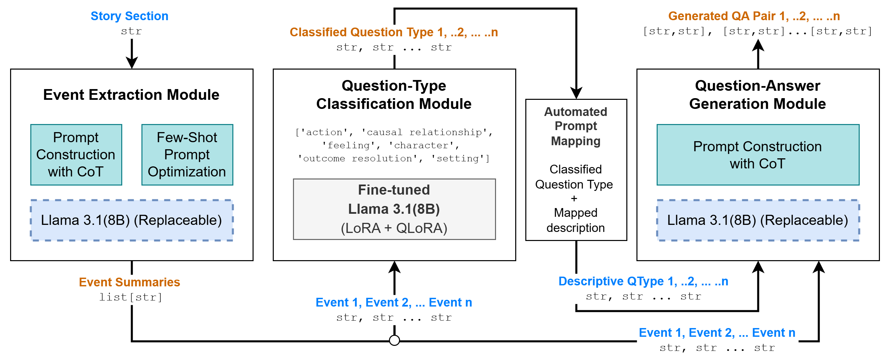

# Question-Answer Generation System

This project implements an AI-powered system that extracts key events from story sections and automatically generates educational question-answer pairs to enhance reading comprehension for children.

## Publication

This repository accompanies the published research paper describing the system and its evaluation:

- **Published paper:** [IEEE Xplore](https://ieeexplore.ieee.org/document/11652148)

If you use this repository in academic work, please cite the published paper using the citation information provided by IEEE Xplore.

## Overview

The system works in four main stages:

1. **Event Extraction**: Analyzes story sections to identify significant events
2. **Question Type Classification**: Determines the most appropriate question type for each event
3. **QA Generation**: Creates relevant question-answer pairs based on the events and question types
4. **Evaluation**: Measures the quality of generated QAs using ROUGE and BERTScore metrics

### System Architecture



## Dataset

This project uses a modified version of the FairytaleQA dataset, which contains fairy tales annotated with question-answer pairs designed to assess and improve children's reading comprehension.

**Citation**:

```
@inproceedings{xu-etal-2022-fantastic,
    title = "Fantastic Questions and Where to Find Them: {F}airytale{QA} -- An Authentic Dataset for Narrative Comprehension",
    author = "Xu, Ying  and
      Wang, Dakuo  and
      Yu, Mo  and
      Ritchie, Daniel  and
      Yao, Bingsheng  and
      Wu, Tongshuang  and
      Zhang, Zheng  and
      Li, Toby Jia-Jun  and
      Bradford, Nora  and
      Sun, Branda  and
      Hoang, Tran Bao  and
      Sang, Yisi  and
      Hou, Yufang  and
      Ma, Xiaojuan  and
      Yang, Diyi  and
      Peng, Nanyun  and
      Yu, Zhou",
    booktitle = "Proceedings of the 60th Annual Meeting of the Association for Computational Linguistics (Volume 1: Long Papers)",
    month = may,
    year = "2022",
    address = "Dublin, Ireland",
    publisher = "Association for Computational Linguistics",
    url = "https://aclanthology.org/2022.acl-long.34",
    pages = "447--460",
}
```

**Paper Link**: [Fantastic Questions and Where to Find Them: FairytaleQA](https://aclanthology.org/2022.acl-long.34/)

## Fine-tuned Models

This project uses custom fine-tuned models based on Llama 3.1:

1. **Question Type Predictor**:

   - HuggingFace: [Alhassany/Llama-3.1-8B-Q-Type-Predictor](https://huggingface.co/Alhassany/Llama-3.1-8B-Q-Type-Predictor)
   - Specifically tuned to classify question types for educational reading comprehension

2. **GGUF Version** (for optimized inference):
   - HuggingFace: [Alhassany/Llama-3.1-8B-Q-Type-Predictor-GGUF](https://huggingface.co/Alhassany/Llama-3.1-8B-Q-Type-Predictor-GGUF)
   - Quantized version for faster local inference with Ollama

## Installation

1. Clone this repository
2. Install the required dependencies:

```bash
pip install -r requirements.txt
```

3. Set up Ollama (for local model inference):
   - Install Ollama from [https://ollama.ai/](https://ollama.ai/)
   - Pull the required models:
   ```bash
   ollama run llama3.1
   ollama run hf.co/Alhassany/Llama-3.1-8B-Q-Type-Predictor-GGUF
   ```

## Usage

1. Prepare your dataset in the required format (see dataset directory structure)
2. Run the main script:

```bash
python qa_gen_final.py
```

Alternatively, you can use the Jupyter notebook for interactive development:

```bash
jupyter notebook qa_gen_final.ipynb
```

## Project Structure

```
Story-Edu-QA-Gen/
├── dataset/
│   ├── updated_train.csv
│   ├── updated_valid.csv
│   └── updated_test.csv
├── imgs/                    # README and architecture images
├── results/                 # Generated/evaluation results
├── qa_gen_final.py          # Main Python script
├── qa_gen_final.ipynb       # Jupyter notebook version
├── requirements.txt         # Project dependencies
├── extract_events_program_optimized.json  # Optimized model settings
└── README.md                # Project documentation
```

## Features

- **Event Extraction**: Identifies meaningful events from story sections
- **Question Type Classification**: Six educational question types:
  - Action
  - Causal relationship
  - Character
  - Setting
  - Outcome resolution
  - Feeling
- **QA Generation**: Creates natural-sounding questions with accurate answers
- **Evaluation**: Uses ROUGE and BERTScore metrics to assess quality

## Evaluation Metrics

The system evaluates generated QA pairs using:

1. **ROUGE Scores** (Recall-Oriented Understudy for Gisting Evaluation):

   - ROUGE-1: Unigram overlap
   - ROUGE-2: Bigram overlap
   - ROUGE-L: Longest common subsequence

2. **BERTScore**: Semantic similarity using contextual embeddings

## License

This project is released under the MIT License.

## Acknowledgments

- FairytaleQA dataset creators for the original dataset
- Meta for the base Llama 3.1 model
- DSPy framework for structured LLM programming
